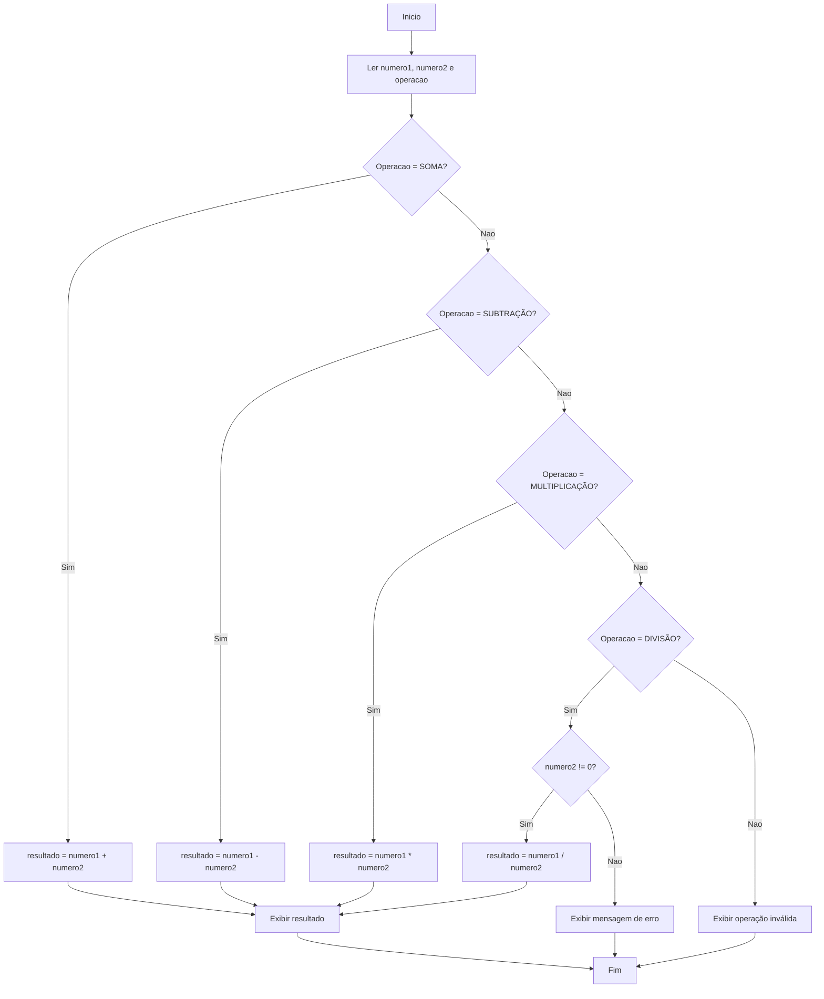

# Ponderada - Semana 8

## Complexidade Ciclomática

A seguir está o algoritmo fiz em Python e que solicita dois números ao usuário, pergunta qual operação matemática deseja realizar e apresenta o resultado. Também abaixo, faço a análise do grafo de fluxo e o cálculo da complexidade ciclomática.

## Algoritmo

```python
def main():
    numero1 = float(input("Digite o primeiro número: "))
    numero2 = float(input("Digite o segundo número: "))
    operacao = input(
        "Digite a operação (SOMA, SUBTRAÇÃO, MULTIPLICAÇÃO ou DIVISÃO): "
    ).strip().upper()

    if operacao == "SOMA":
        resultado = numero1 + numero2
    elif operacao == "SUBTRAÇÃO":
        resultado = numero1 - numero2
    elif operacao == "MULTIPLICAÇÃO":
        resultado = numero1 * numero2
    elif operacao == "DIVISÃO":
        if numero2 != 0:
            resultado = numero1 / numero2
        else:
            print("Não é possível dividir por zero.")
            return
    else:
        print("Operação inválida.")
        return

    print(f"Resultado: {resultado}")


if __name__ == "__main__":
    main()
```

## Grafo de Fluxo (Usei o GPT pra gerar o Diagrama Mermaid com base no algoritmo)



## Cálculo da Complexidade Ciclomática

A complexidade ciclomática pode ser calculada pela fórmula:

**M = E - N + 2P**

Sendo:

- **E = 19** arestas
- **N = 15** nós
- **P = 1** componente conexo

Substituindo na fórmula:

**M = 19 - 15 + 2(1)**

**M = 6**

Também é possível confirmar pelo número de decisões do programa:

- 4 decisões para escolher a operação
- 1 decisão para verificar se o divisor é diferente de zero

Assim:

**M = 5 + 1 = 6**

## Resposta final

Assim, concluímos que a complexidade ciclomática do algoritmo é **6**, já que existem seis caminhos independentes possíveis na execução.
